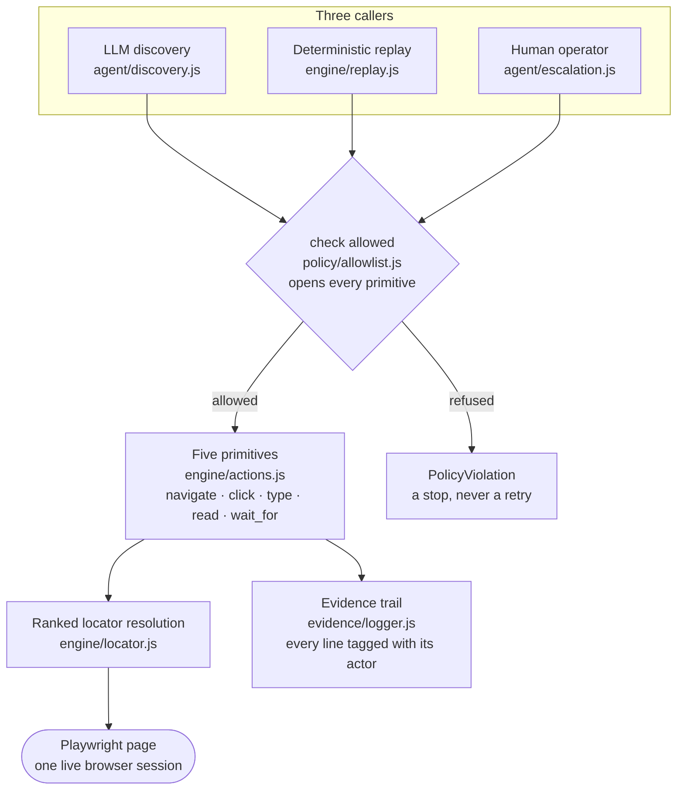
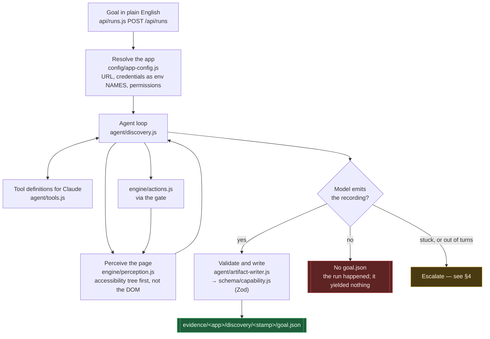
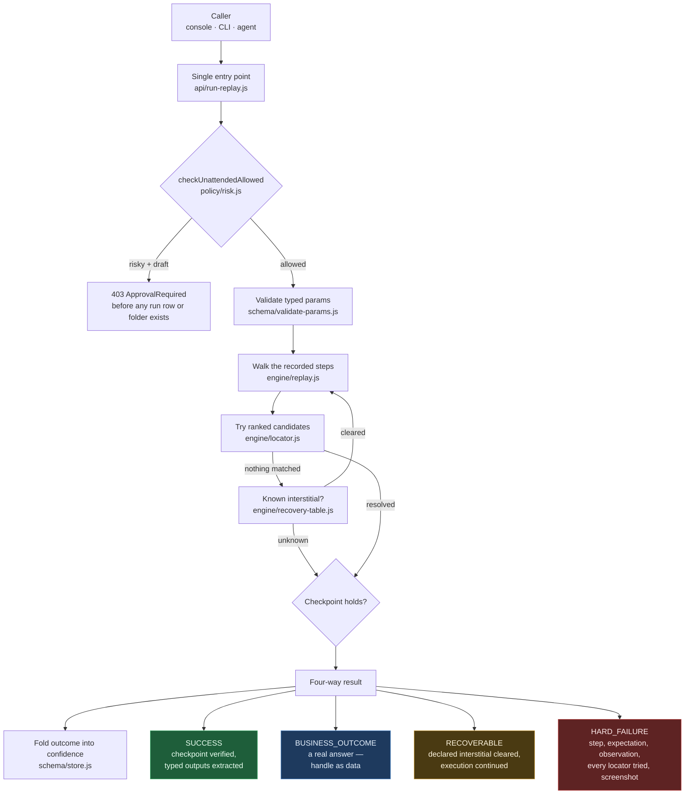
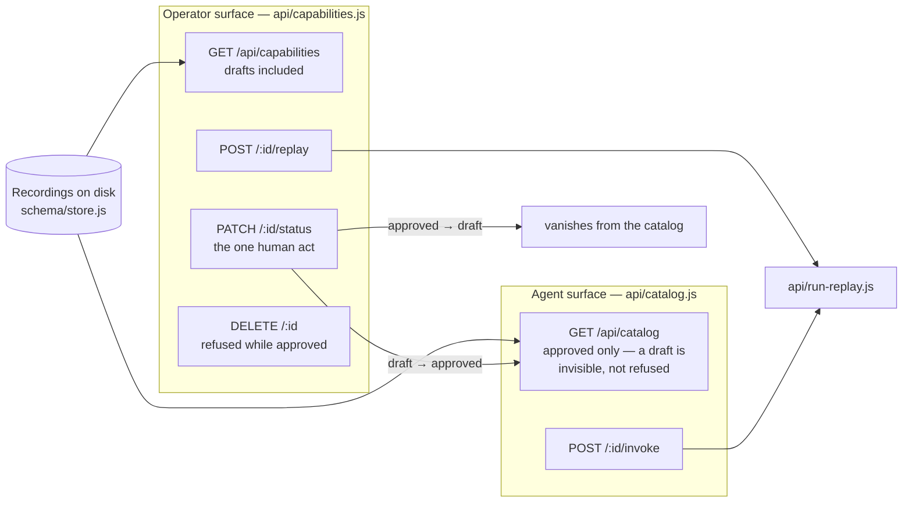
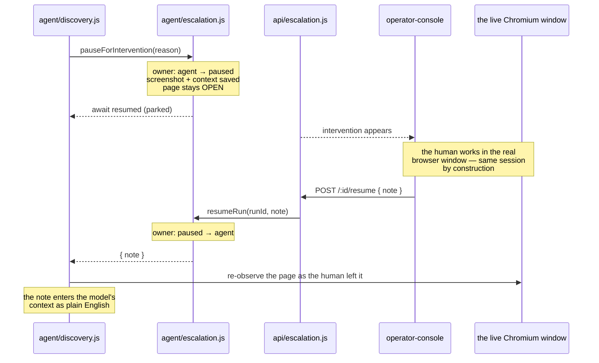
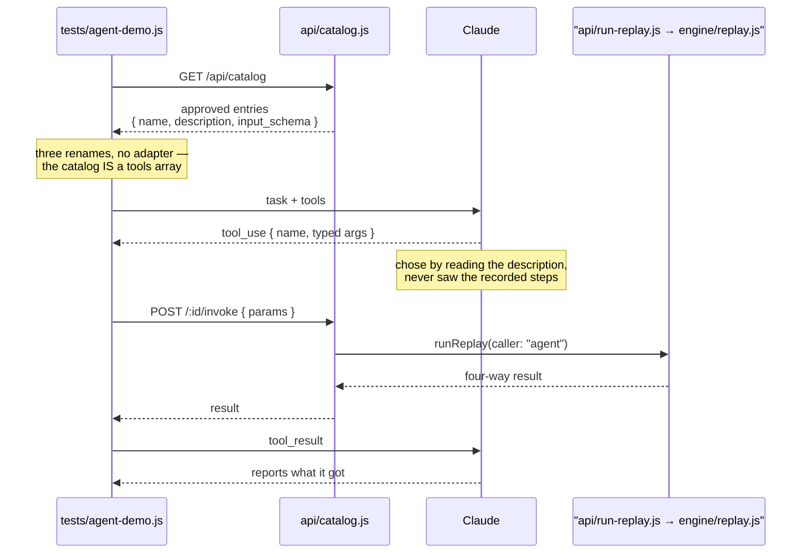
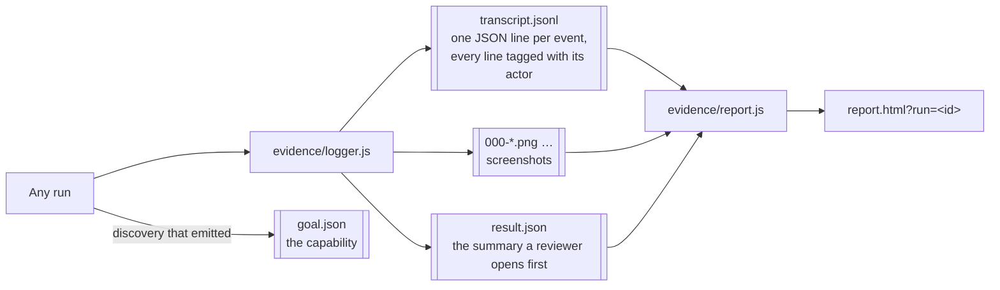

# DESIGN.md — the flow, and the file that does each job

Every box names the file that actually does the work, so you can go from a picture to the
code without hunting. Diagrams render on GitHub.

Here's the idea the whole system is built around:

> **The model discovers. The recording becomes a reusable capability. Deterministic replay
> is how a production agent invokes it.**

---

## The shape of it

Three things can act on the page — the AI, replay, and a human. They all go through the
same set of actions, and they all write to the same kind of log.

Two things matter here, and they're both true because of how the code is built, not just
because we say so:

- **There's only one version of "click."** Not one for the AI and a different one for
  replay. If you ever find a second implementation of any of the five actions anywhere in
  this repo, something's wrong. The model doesn't get to just click on things — it has to
  pick one of the five actions, the same way replay does.
- **There's only one gate, and it can't be skipped.** `checkAllowed` runs first, inside
  the action itself, not as a separate step a caller has to remember to do. And no
  permission setting can ever let an app act outside its own website — that line never
  moves.

---

## 1. Discovery — the model works it out once

**Why the accessibility tree.** It's the one way of reading a page that works everywhere —
a modern web app, an old clunky one built out of tables, and even a desktop app. If we
ever swap Playwright for something else, only this one file has to change.

**The recording lives right next to the proof it worked.** There's no separate folder for
capabilities. `goal.json` sits in the same run folder as the screenshots and the log from
that same run. If a folder has a `goal.json` in it, that run succeeded and can be
replayed. If it doesn't, it didn't.

**The model never actually sees a password.** `config/app-config.js` loads real
credentials into the environment under a made-up name, and only tells the model the
*name* — never the value. The model decides where a password goes on the page without
ever knowing what the password is.

---

## 2. Replay — no model, ever

**`engine/replay.js` never imports the AI SDK.** That's the whole point of this file. If
that import ever shows up here, replay stops being deterministic — same input won't
reliably give the same output anymore.

**BUSINESS_OUTCOME is the most important idea in this whole system.** "No such member" is
a real, useful answer — not a crash. So the recording writes down ahead of time what a
valid non-happy-path answer looks like on the page, and replay checks for that *before* it
decides a step failed. It checks again if a button or field can't be found at all, because
sometimes "it's not there" IS the answer.

**A refusal isn't a failure.** If a capability gets refused before it even starts — a
risky one that hasn't been approved yet, say — nothing gets written down anywhere. No run,
no folder, no mark on its track record. Nothing happened, so nothing gets recorded as
having happened.

**Cross-tenant reuse happens before any of the rest of this starts.** If a `tenant_id` is
passed in, `applyTenantOverride()` swaps out a few locators or the site's address before
replay even begins. Everything after that runs exactly like normal — replay has no idea a
swap happened. Most tenants using the same underlying product need no swap at all. One
with a couple of relabeled buttons only needs those buttons listed, not a whole new
recording.

---

## 3. The approval gate, and the two surfaces it separates

There's one place capabilities are stored, but two different views into it. The narrower
view is what an AI agent gets to see.

Every capability starts as a draft. The only way it becomes "approved" is a human doing it
by hand — the system never approves its own work. Taking approval back is just as easy as
giving it, on purpose: if a capability starts failing a lot, it should be pullable from
the agent's list right away, without deleting the recording or its history.

---

## 4. Escalation — a human on the same session

**Two safety checks work together here.** One flag says who's *supposed* to be in
control. A separate lock says who's *actually* in control right now, at this exact
moment. Both are needed — even though the code runs on one thread, it can still jump
between the AI and a human mid-action if you're not careful. "It's single-threaded so it's
fine" would be the wrong assumption to make here.

**Handing control back happens in plain English, not clicking.** The goal was written in
English and the model thinks in English, so when a human steps in and fixes something,
they just describe what they did — like *"the code is 481920, type it into the code
box"* — and the model picks up from there the same way it already understands things.
There's still a way for a human to click and type directly on the page too
(`performManualAction`), and it goes through the exact same five actions everything else
uses, just tagged as done by a human instead of the AI. It's just not usually what the
operator is asked to do by hand.

---

## 5. An agent calling the catalog

This is the one part where an outside program actually calls into this system over the
network, instead of through the codebase directly. `tests/agent-demo.js` doesn't import
anything from `src/` on purpose — if it could reach into the code directly, it wouldn't
prove anything about what a real outside caller can actually do.

Take away a capability's approval and try this again: the AI is told it has no tools at
all to use. A human's approval is what decides what an AI agent is even allowed to try.

---

## Where a run's evidence goes

The AI, replay, and a human operator all write their logs in the exact same format. If
each one needed its own way of being read, the logs wouldn't really prove anything. Folder
names are timestamps, so they're already in the right order — there's no separate list
that could ever get out of sync with them.

**Sensitive values get hidden right when they're written to the log** (`policy/redact.js`),
not later. The real browser still gets the real password, since it actually needs it to
log in — but the log itself only ever sees something like `<string:13>` (just the length,
never the value). A `redacted` flag gets written either way, so anyone reading the log can
see the rule actually ran, instead of just assuming it did.
