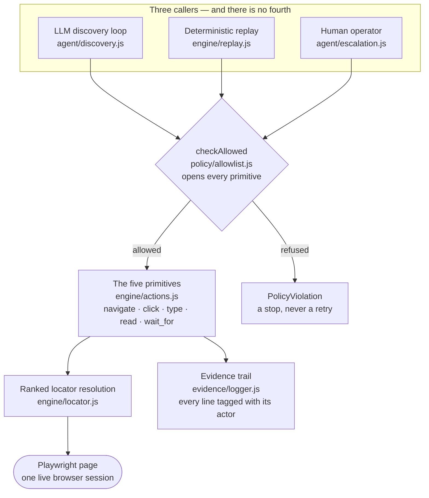
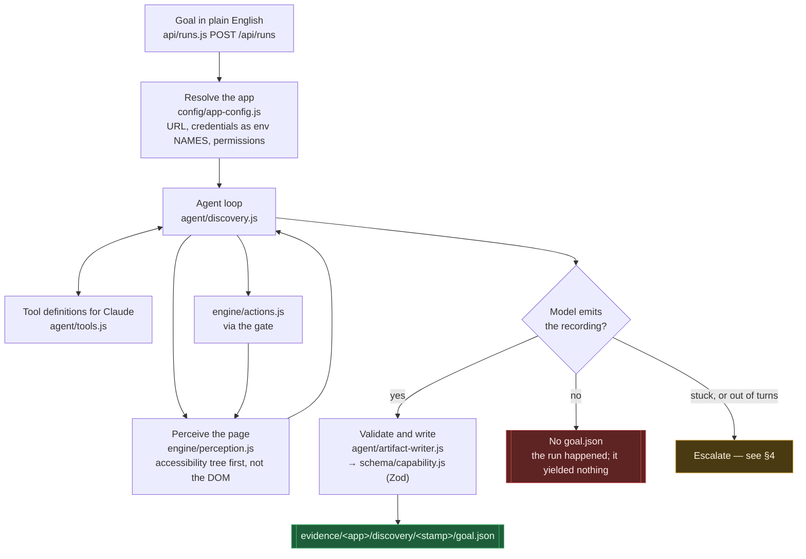
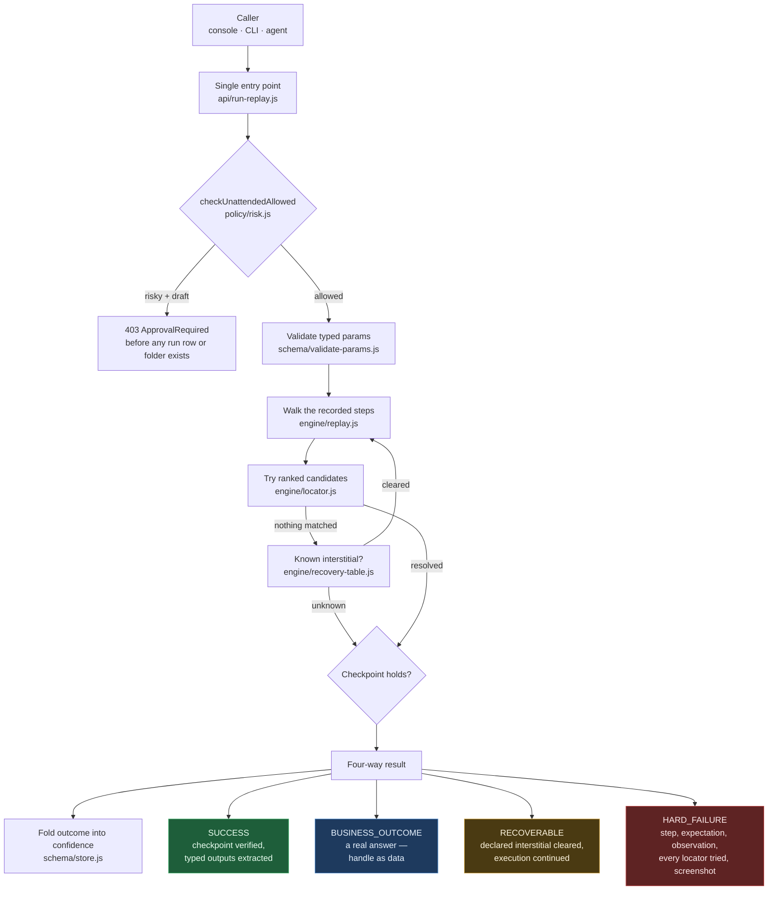
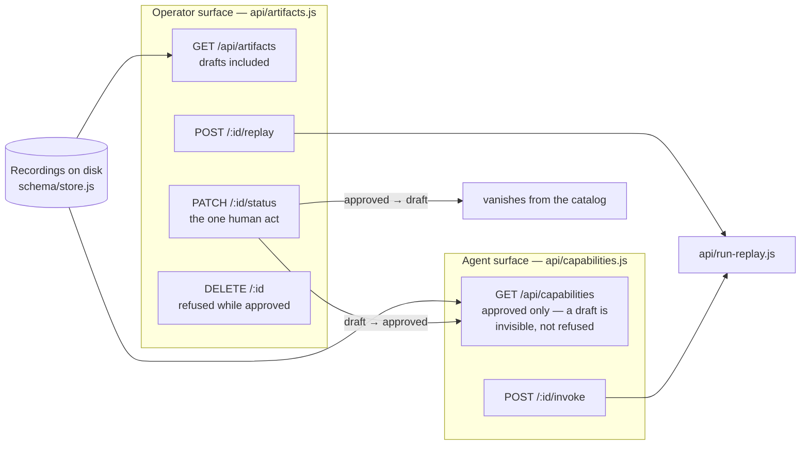
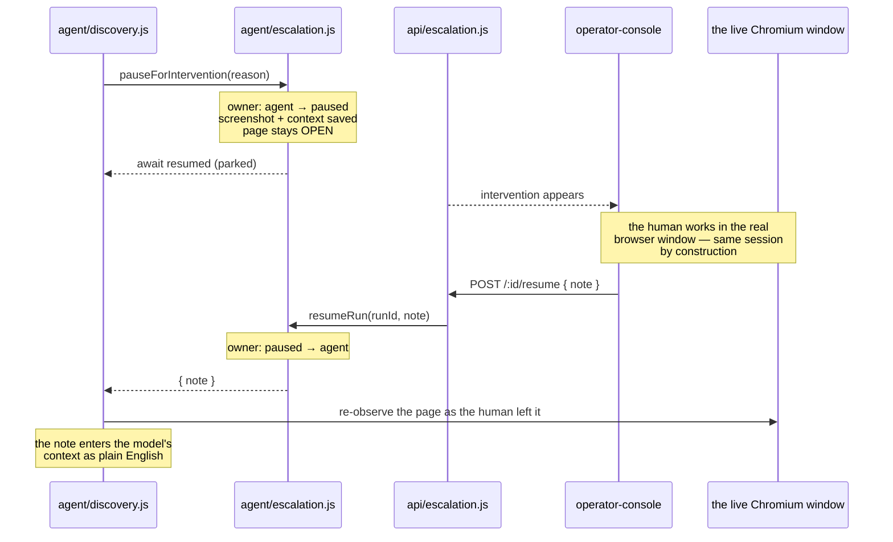
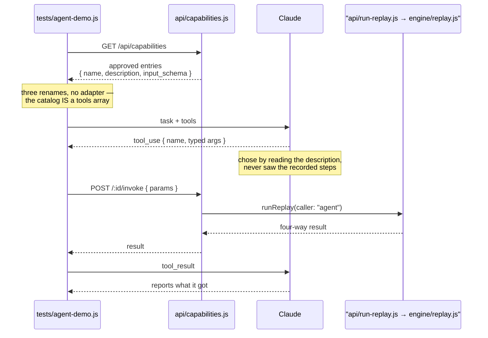
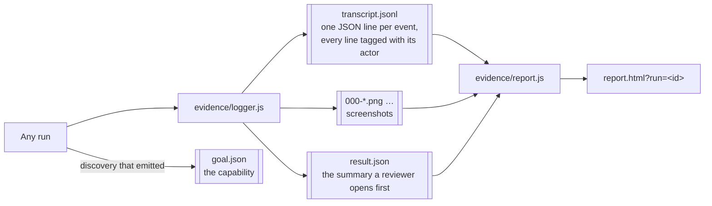

# DESIGN.md — the flow, and the file that does each job

Every box names the file that actually does the work, so you can go from a picture to the
code without hunting. Diagrams render on GitHub.

The through-line the whole system is arranged around:

> **The model discovers. The recording becomes a reusable capability. Deterministic replay
> is how a production agent invokes it.**

---

## The shape of it

Three callers, one action layer, one evidence trail.

Two claims are load-bearing here, and both are structural rather than promised:

- **One action layer.** If a reviewer finds a second implementation of "click" anywhere in
  this repo, the design claim is false. The model does not get to *just click* — it
  chooses which of the five primitives to invoke, exactly as replay does.
- **One gate.** `checkAllowed` is the first line of each primitive rather than a thing each
  caller remembers to call, so no caller can forget it. The app's own origin is the hard
  edge; no permission setting widens it.

---

## 1. Discovery — the model works it out once

**Why the accessibility tree.** It is the one perception channel that exists on a modern
web app, a frameset-and-nested-tables legacy app, *and* a native desktop app. Swapping
Playwright for an OS accessibility API later changes one file.

**The recording lives in the run folder.** There is no separate artifacts tree and no
promotion step: `goal.json` sits beside the transcript and screenshots that prove it ran.
A discovery folder *with* one passed its gates; one without did not.

**The model never learns a secret.** `config/app-config.js` pushes credential values into
`process.env` under derived names and passes only the **names** to the prompt. The model
decides where a password goes; the harness resolves what it is, after the fact.

---

## 2. Replay — no model, ever

**`engine/replay.js` imports no LLM SDK.** That is the invariant the determinism claim
rests on — if the Anthropic SDK ever appears in that file, the thesis is broken.

**BUSINESS_OUTCOME is the point.** Collapsing *"no such member"* into a crash is the most
common way this problem gets got wrong, so business outcomes are **declared in the
recording** and checked *before* the success checkpoint — and again when a locator resolves
to nothing, because a missing element is sometimes the answer rather than a fault.

**A refusal is not a failure.** The gate runs before anything is written, so a refused
capability leaves no run row, no evidence folder, and no mark on its confidence: nothing
happened, and the record says nothing happened.

**Cross-tenant reuse is a seam in front of this diagram, not a branch inside it.** An
optional `tenant_id` runs `applyTenantOverride()` before ENTRY does anything else — it
patches the named steps' locators/urls (and optionally points at a different origin) and
hands `EXEC` an ordinary capability. Everything from PARAMS onward, including the
four-way outcome contract and the confidence fold, has no idea a patch happened. A tenant
running the identical vendor product needs no override at all; one with a couple of
relabeled buttons needs only those steps named, not a re-record.

---

## 3. The approval gate, and the two surfaces it separates

One store, two views. The narrower one is what an agent gets.

A capability is born `draft`. Promotion is the only act the system never grants itself.
Demotion is deliberately as easy as promotion — a capability whose replays start failing
should be pullable immediately, without deleting the recording or its history.

---

## 4. Escalation — a human on the same session

**Two mechanisms, both needed.** An explicit `owner` flag says who *should* be acting; a
per-run async mutex (`RunLock`) says who *is*. Node is single-threaded, but async handlers
interleave at every `await` — "it's single-threaded so it's fine" would be wrong.

**The channel back is language, not selectors.** The goal was written in English and the
model reasons in English, so the operator says *"the code is 481920, type it into the code
box"* and the model does what it already knows how to do. `performManualAction` still
exists and still routes human actions through the same five primitives tagged
`actor: "human"` — it is simply not what the operator is asked to fill in by hand.

---

## 5. An agent calling the catalog

The one path that crosses a process boundary. `tests/agent-demo.js` imports nothing
from `src/` — if it could reach into the codebase it would prove nothing about what an
outside caller can do.

Revoke the capability and run it again: the model is told it has no tools. **A human's
approval decision is what an agent is able to do.**

---

## Where a run's evidence goes

One format serves all three actors — the LLM loop, replay, and the human operator — because
an evidence trail that needed three readers would prove nothing. Folder names sort
chronologically, so the history needs no index that could disagree with it.

**Redaction happens at the point of logging** (`policy/redact.js`), not at the point of
use: the live browser gets the real password, the transcript gets `<string:13>`, and an
explicit `redacted` flag is written either way so a reviewer can see the rule ran.
